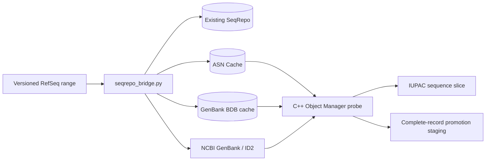

# Step-by-step capability demonstration

This walkthrough demonstrates the repository from a clean shell: verify the
Apple-silicon Docker environment, build the native NCBI tools, retrieve exact
RefSeq ranges, prove offline ASN Cache behavior, exercise GenBank fallback,
validate reference alleles, and stage a complete RefSeq record for SeqRepo.

The commands assume the repository is the current directory. Generated data is
written only under `work/` and `results/`; those directories are ignored by Git.

## What the demo proves



By the end, you will have demonstrated:

- native `linux/arm64` execution;
- 0-based, half-open RefSeq range retrieval;
- ASN Cache access with networking physically disabled;
- explicit remote GenBank access;
- bounded complete-record reconstruction and FASTA staging;
- coordinate/schema tests and the native image smoke test;
- optionally, indexed gnomAD slicing and the full experiment matrix.

This demo does not silently install Docker, Python packages, or SeqRepo. It also
does not write into SeqRepo unless you explicitly run the final optional command
with `--write` against your own writable working instance.

## 1. Verify the workspace

```bash
pwd
git status -sb
docker context show
docker info --format 'os={{.OSType}} arch={{.Architecture}} cpus={{.NCPU}} memory={{.MemTotal}}'
```

Expected characteristics:

```text
branch: main
Docker context: desktop-linux
daemon OS: linux
daemon architecture: aarch64
```

Run the repository's complete non-destructive host checks:

```bash
bash scripts/prepare_host_macos.sh
bash scripts/diagnose_docker_desktop.sh
```

These checks confirm native ARM execution, a read-only workspace mount, bridge
and BuildKit networking, and the expected failure of a `--network none` control.

## 2. Build the native NCBI image

This is the longest step. It compiles the pinned NCBI C++ Toolkit revision inside
an Ubuntu 22.04 ARM64 builder with GCC 12 and C++20. The initial parallelism is
bounded at eight jobs.

```bash
make build
```

No NCBI source or build directory is bind-mounted onto macOS. Confirm the final
image and required binaries:

```bash
make smoke

docker run --rm --platform linux/arm64 gks-ncbi:arm64 \
  gks_ncbi_sequence_probe -version

docker run --rm --platform linux/arm64 gks-ncbi:arm64 \
  bcftools --version
```

Expected smoke-test conclusion:

```text
Native ARM image smoke test passed.
```

If `gks-ncbi:arm64` already exists, you may proceed without rebuilding.

## 3. Run fast automated checks

```bash
make test
```

The suite covers coordinate conversion, SNV/insertion/deletion anchors,
off-by-one detection, JSON result schema, versioned accession enforcement,
SeqRepo namespace fallback, conservative aliases, and chunk reconstruction.

Expected result for the current repository:

```text
Ran 14 tests
OK
```

## 4. Prepare an indexed gnomAD sample

This step uses network access, but reads only an indexed chrX region. It does
**not** download the complete chromosome VCF.

```bash
bash scripts/prepare_vcf.sh
```

Outputs:

```text
work/gnomad.sample.minimal.vcf.bgz
work/gnomad.sample.minimal.vcf.bgz.tbi
work/requests.tsv
results/vcf_preparation.json
```

Inspect the conversion from VCF coordinates to the probe's 0-based, half-open
requests:

```bash
sed -n '1,6p' work/requests.tsv
python3 -m json.tool results/vcf_preparation.json
```

For VCF position `POS`, the adapter uses:

```text
start = POS - 1
end   = start + length(REF)
```

## 5. Hydrate and verify ASN Cache

This is a networked and potentially several-minute step. It resolves the complete
selected RefSeq record and writes NCBI-native serialized objects locally.

```bash
bash scripts/seed_asn_cache.sh
```

The script:

1. hydrates `NC_000023.11` with `prime_cache -extract-delta`;
2. validates the cache using `asn_cache_test`;
3. retrieves three slices online;
4. repeats them in a new `--network none` container;
5. compares the results and records timing, peak RSS, and cache size.

Expected conclusion:

```text
ASN cache online/offline verification passed.
```

## 6. Fetch one RefSeq slice offline

The bridge accepts a versioned accession and a 0-based, half-open interval. In
ASN-only mode it launches the native probe with Docker networking disabled.

```bash
python3 scripts/seqrepo_bridge.py --mode asn \
  fetch NC_000023.11 253592 253600
```

Expected sequence and source:

```json
{
  "accession": "NC_000023.11",
  "start": 253592,
  "end": 253600,
  "sequence": "GGCTCCCA",
  "source": "ncbi-asn"
}
```

The actual one-line JSON also includes record length and NCBI aliases. A failure
here while `--network none` is active cannot silently fall back to GenBank.

The same demonstration is available as:

```bash
make bridge-fetch
```

## 7. Use explicit remote GenBank access

Remote access must be opted into twice: select `genbank` mode and pass
`--allow-remote`.

```bash
python3 scripts/seqrepo_bridge.py --mode genbank --allow-remote \
  fetch NM_000546.6 0 20
```

The result identifies its source as `ncbi-genbank`. Omitting `--allow-remote`
fails before retrieval, preventing an accidental network dependency.

Hybrid mode checks ASN Cache first and permits GenBank fallback only when the
same explicit flag is present:

```bash
python3 scripts/seqrepo_bridge.py --mode hybrid --allow-remote \
  fetch NM_000546.6 0 20
```

## 8. Stage complete-record promotion

SeqRepo aliases and digests represent complete sequences, not arbitrary
fragments. Promotion therefore reconstructs the complete versioned RefSeq Bioseq
in bounded chunks, validates it, and is dry-run by default.

Use the small `NM_000546.6` transcript for a quick live demonstration:

```bash
python3 scripts/seqrepo_bridge.py --mode genbank --allow-remote \
  promote NM_000546.6 \
  --chunk-size 500 \
  --fasta-output work/NM_000546.6.fasta
```

Expected manifest characteristics:

```json
{
  "accession": "NM_000546.6",
  "committed": false,
  "length": 2512,
  "source": "ncbi-genbank"
}
```

Inspect the staged FASTA:

```bash
sed -n '1,4p' work/NM_000546.6.fasta
wc -c -l work/NM_000546.6.fasta
```

`committed: false` is important: no SeqRepo mutation occurred. The bridge has
validated accession version, chunk ordering, total sequence length, alphabet,
and conservative RefSeq/GI/GPP aliases.

## 9. Demonstrate contained-range cache reuse

Create a larger request followed by a contained request:

```bash
mkdir -p work

printf 'request_id\taccession\tstart\tend\texpected_ref\nlarge\tNC_000023.11\t253000\t254000\t\ninside\tNC_000023.11\t253592\t253600\tGGCTCCCA\n' \
  > work/demo-nested.tsv
```

Run both requests in one Object Manager process through ASN Cache:

```bash
docker run --rm --network none --platform linux/arm64 \
  -v "$PWD:/workspace" -w /workspace gks-ncbi:arm64 \
  gks_ncbi_sequence_probe \
    -mode asn \
    -asn-cache work/asn_cache_full \
    -requests work/demo-nested.tsv \
    -output work/demo-nested.jsonl \
    -fail-on-mismatch

python3 -m json.tool --json-lines work/demo-nested.jsonl
```

The second request returns the substring of the first while the container has no
network. This proves local contained-range reuse for the hydrated record; it does
not prove that the original upstream hydration transferred only that range.

## 10. Run the experiment matrix

After VCF preparation and ASN hydration:

```bash
bash scripts/run_experiment_matrix.sh
```

This records cold, warm, offline, hybrid, BDB, and 10,000-record correctness
cases under `results/raw/`, then produces:

```text
results/metrics.csv
```

Inspect selected columns:

```bash
python3 - <<'PY'
import csv

with open("results/metrics.csv", newline="") as stream:
    for row in csv.DictReader(stream):
        print(
            row["case"],
            "requests=" + row["request_count"],
            "matches=" + row["success_count"],
            "errors=" + row["error_count"],
            "p50_us=" + row["p50_us"],
        )
PY
```

The completed local experiment also expanded the indexed region to 100,000
eligible chrX records and obtained 100,000/100,000 REF matches offline.

## 11. Optional: read an existing SeqRepo first

This requires `biocommons.seqrepo` in a dedicated Python environment and an
existing local snapshot. The dependency is intentionally not installed by this
repository.

```bash
python3 scripts/seqrepo_bridge.py --mode asn \
  fetch NC_000023.11 253592 253600 \
  --seqrepo-root /path/to/seqrepo/snapshot
```

The adapter tries `refseq`, legacy `NCBI`, and unqualified aliases. A hit returns
`"source": "seqrepo"`; a miss falls back to the selected NCBI mode.

## 12. Optional: write to a SeqRepo working instance

Do this only with a deliberately writable SeqRepo working directory, never a
published read-only snapshot:

```bash
python3 scripts/seqrepo_bridge.py --mode genbank --allow-remote \
  promote NM_000546.6 \
  --seqrepo-root /path/to/seqrepo/master \
  --write
```

Before commit, the bridge refuses an existing accession alias that resolves to
different bases. After `store()` and `commit()`, it fetches the complete sequence
back and compares it with the NCBI-derived sequence.

The current repository has unit-tested this guarded write path, but has not yet
run it against a user-supplied writable SeqRepo instance.

## Reading the results correctly

The demonstrated claims are deliberately narrow:

- ASN Cache is pre-seeded and deterministic; it is not assumed to be write-through.
- GenBank BDB persistence was demonstrated for tested records, not every RefSeq record.
- Range-oriented client access may still cause record/blob-scale upstream transfer.
- SeqRepo stores complete sequence identities and then serves slices efficiently.
- A stored fragment must never be assigned the alias of its complete RefSeq record.

See [README.md](README.md) for the architecture and project status, and
[PLAN.md](PLAN.md) for the full experiment design and acceptance gates.
