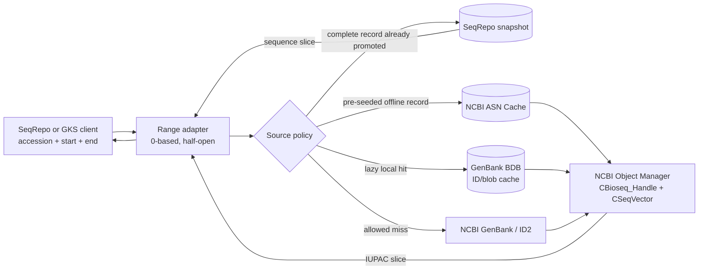
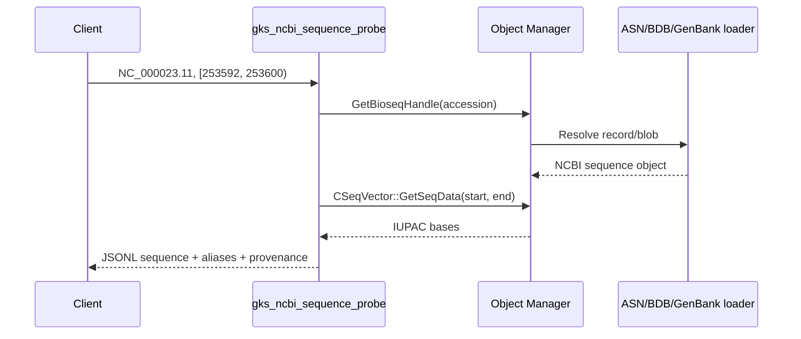

# RefSeq lazy cache and SeqRepo bridge experiment

This repository explores a missing middle layer between NCBI RefSeq and
[SeqRepo](https://pypi.org/project/biocommons.seqrepo/): retrieve only the
sequence ranges an application asks for, let the NCBI C++ Toolkit reuse the
underlying RefSeq record locally, and promote useful records into SeqRepo when
long-term, digest-addressed storage is justified.

The project is an experimentally validated retrieval and cache foundation.
`scripts/seqrepo_bridge.py` now implements the first adapter and guarded
promotion workflow. It can read an existing SeqRepo first, fall back to the NCBI
probe, stage a complete record as FASTA, and explicitly commit a validated full
sequence to a writable SeqRepo. Production service packaging and snapshot
lifecycle automation remain follow-on work.

For a scrollable results-first tour with captured outputs, open
[`DEMO.ipynb`](DEMO.ipynb). For the complete reproducible command walkthrough,
use [`DEMO.md`](DEMO.md).

## Project status

The repository currently contains a working native NCBI retrieval backend, two
validated NCBI cache strategies, an experiment harness, and the first SeqRepo
adapter/promotion command. It is a functional prototype and research artifact,
not a production service or a replacement SeqRepo distribution.

| Capability | Status |
|---|---|
| Native NCBI C++ Toolkit build on Apple silicon | Working and reproducible with Ubuntu 22.04, GCC 12, C++20, and `linux/arm64` |
| Versioned RefSeq range retrieval | Working through `gks_ncbi_sequence_probe` with 0-based, half-open coordinates |
| Pre-seeded ASN Cache | Working offline in a new `--network none` container |
| GenBank BDB reader cache | Cold population, new-process reuse, contained-range replay, and offline replay demonstrated for the tested chrX record |
| Hybrid ASN-first/GenBank-fallback loading | Working with explicit remote permission |
| gnomAD REF validation | 100,000/100,000 eligible chrX records matched offline |
| SeqRepo-first range adapter | Implemented; requires an existing local SeqRepo for the first lookup tier |
| Complete-record promotion staging | Implemented and live-tested through FASTA/manifest generation |
| Writable SeqRepo promotion | Implemented behind explicit `--write`; unit-tested but not yet exercised against a supplied writable SeqRepo instance |
| Production API, concurrency, and snapshot lifecycle | Not implemented |

The latest live adapter checks used the existing chromosome ASN Cache to return
`NC_000023.11[253592:253600)` as `GGCTCCCA` in a network-disabled container.
The promotion pipeline also resolved `NM_000546.6` through live GenBank,
reconstructed all 2,512 bases in six bounded chunks, validated the result, and
staged a complete FASTA without mutating SeqRepo. The repository test suite
currently contains 14 passing tests, plus the native ARM image smoke test.

## What this repository is meant to enable

The intended consumer is a SeqRepo, GKS, VRS, or other sequence application that
needs a small number of versioned RefSeq ranges before those records exist in its
local sequence archive. The bridge is meant to:

1. accept a versioned RefSeq accession and exact `[start, end)` interval;
2. return only the requested IUPAC bases to the caller;
3. prefer an existing SeqRepo copy when available;
4. otherwise resolve the range through deterministic ASN Cache, lazy GenBank BDB
   cache, or explicitly permitted remote GenBank access;
5. preserve identifiers and provenance across that lookup;
6. promote a frequently used record into SeqRepo only after reconstructing and
   validating the complete sequence represented by the RefSeq accession.

It is deliberately **not** meant to assign a full RefSeq accession to a stored
fragment, reproduce RefSeq annotations inside SeqRepo, silently enable remote
access, or claim byte-range upstream transfers when NCBI actually resolves a
larger record/blob.

## Why bridge these systems?

RefSeq and SeqRepo solve related but different problems:

| System | Strength | Relevant behavior |
|---|---|---|
| RefSeq through the NCBI GenBank Loader | Authoritative accession/version resolution and current NCBI records | Remote on first access; NCBI Object Manager may resolve records as blobs |
| NCBI ASN Cache | Deterministic, pre-seeded, offline NCBI-native records | Stores serialized ASN.1 objects and is read by `CAsnCache_DataLoader` |
| GenBank BDB reader cache | Transparent local reuse after remote GenBank/ID2 access | Can populate on demand and replay a tested record in a new offline process |
| SeqRepo | Nonredundant, digest-addressed sequence archive with aliases | Stores complete sequences, then serves fast 0-based, half-open slices from BGZF-backed storage |

SeqRepo already makes a stored chromosome feel slice-oriented:

```python
sr["NC_000001.11"][780000:780020]
```

The gap is acquisition. A user may need only a few RefSeq intervals and may not
want to install or mirror a broad SeqRepo release first. This project uses NCBI's
native loaders to resolve those intervals and to avoid repeated remote work.

## The key semantic distinction

“Fetch a section” and “store a section under the RefSeq accession” are not the
same operation.

SeqRepo associates aliases and sequence digests with a complete sequence. The
alias `refseq:NC_000023.11` and its GA4GH/SeqRepo digest must identify the entire
versioned chromosome sequence, not an arbitrary substring. Storing bases
`253592:253600` under that full-record alias would create the wrong digest,
length, and biological identity.

Therefore the bridge should support two primary tiers:

1. **Range access:** return an exact requested slice from Object Manager, backed
   by ASN Cache or the GenBank reader cache. No SeqRepo mutation is required.
2. **Record promotion:** when reuse warrants it, materialize the complete RefSeq
   sequence as IUPAC text/FASTA and import that complete sequence and its aliases
   into a writable SeqRepo snapshot. SeqRepo can then serve arbitrary slices.

An optional fragment tier is possible, but every fragment must have a distinct,
coordinate-qualified identity such as
`refseq-region:NC_000023.11:253592-253600`. It must never masquerade as the full
RefSeq accession, and consumers would need fragment-aware coordinate mapping.

## Proposed architecture



The adapter should keep one public contract regardless of the selected backend:

```text
fetch(accession_version, start, end) -> IUPAC sequence
```

Coordinates are always 0-based and half-open. Accessions should be versioned so
that a mutable “latest” lookup cannot silently change the returned sequence.

## What this repository implements today

`gks_ncbi_sequence_probe` is the working C++ boundary. It:

- creates an explicit NCBI `CObjectManager` and `CScope`;
- registers only the requested data loaders instead of relying on ambient defaults;
- supports `genbank`, `asn`, and `hybrid` loader modes;
- resolves a RefSeq accession to a `CBioseq_Handle`;
- extracts `[start, end)` with `CSeqVector::GetSeqData` in IUPAC coding;
- emits the requested sequence, aliases, length, timing, and validation result as JSONL;
- keeps Object Manager and scope alive across a request batch and repeat cycles;
- supports a new-container `--network none` test for real offline evidence.



The image also contains the NCBI tools `prime_cache`, `asn_cache_test`,
`asn2asn`, `asn2fasta`, `asn2flat`, and `asnvalidate`.

## ASN.1 binary to SeqRepo sequence data

SeqRepo does not need ASN.1 annotations or serialized NCBI objects. It needs the
biological sequence as normalized text plus identifiers. There are two sensible
conversion paths.

### Direct range path: no FASTA file

The current probe already performs the important conversion in memory:

```cpp
handle.GetSeqVector(CBioseq_Handle::eCoding_Iupac)
    .GetSeqData(start, end, observed);
```

`CSeqVector` hides whether the underlying sequence came from binary ASN Cache,
BDB blobs, delta components, or the remote GenBank loader. It returns printable
IUPAC nucleotide or amino-acid symbols. For an online range service, JSONL,
stdout, a pipe, or a small local RPC protocol can pass those bases to a Python
adapter without creating an intermediate FASTA file.

### Complete-record promotion path: FASTA or streaming text

To create a correct SeqRepo entry, export the **complete resolved Bioseq** and
associate the complete sequence with versioned RefSeq aliases. Two implementations
are reasonable:

- extend the C++ adapter to stream the complete `CSeqVector` as FASTA or raw
  IUPAC text; or
- use the bundled NCBI `asn2fasta` tool against an ASN.1 object exported from the
  cache/toolkit workflow.

The direct C++ path is preferable for the adapter because it avoids coupling the
service to temporary file formats. `asn2fasta` remains valuable for bulk import,
inspection, and interoperability. In both cases, validate sequence length,
alphabet, accession version, aliases, and digest before committing a SeqRepo
snapshot.

## Adapter commands

Fetch one range from SeqRepo when present, with ASN Cache fallback:

```bash
python3 scripts/seqrepo_bridge.py --mode asn \
  fetch NC_000023.11 253592 253600 \
  --seqrepo-root /path/to/seqrepo/snapshot
```

If `--seqrepo-root` is omitted, the command uses the selected NCBI loader
directly. ASN-only Docker fallback runs with `--network none`. `genbank` mode
requires both `--mode genbank` and `--allow-remote`; hybrid mode permits remote
fallback only when `--allow-remote` is present.

Stage and validate a complete record without mutating SeqRepo:

```bash
python3 scripts/seqrepo_bridge.py --mode asn \
  promote NC_000023.11 \
  --fasta-output work/NC_000023.11.fasta
```

Promotion fetches the resolved Bioseq in bounded one-million-residue chunks,
checks ordering, length, and alphabet, and emits a manifest. The FASTA represents
the complete accession, never an individual requested range.

Commit to a deliberately writable SeqRepo only with the explicit `--write` flag:

```bash
python3 scripts/seqrepo_bridge.py --mode asn \
  promote NC_000023.11 \
  --seqrepo-root /path/to/seqrepo/master \
  --write
```

The bridge opens SeqRepo with `writeable=True`, refuses an existing alias that
resolves to different bases, stores the complete sequence with versioned RefSeq
aliases, commits, and reads the full sequence back for verification. Published
read-only snapshots should never be passed to this command; promote into a
writable working instance and use SeqRepo's snapshot process afterward.

The Python package is intentionally an adapter-only dependency and is not
silently installed on the macOS host. Install `biocommons.seqrepo` and its
`bgzip` requirement in a dedicated environment used for SeqRepo reads/writes.
NCBI-only fetching does not import SeqRepo unless `--seqrepo-root` is supplied.

## Intended iterative user experience

The desired behavior is iterative at the **request layer**, even when NCBI or
SeqRepo stores a larger unit underneath:

```text
request 1: NC_000023.11 [253592, 253600)  -> fetch/cache record, return 8 bases
request 2: NC_000023.11 [400000, 400050)  -> reuse cached record, return 50 bases
request 3: NC_000023.11 [253594, 253598)  -> contained local hit, return 4 bases
promotion: repeated use crosses policy threshold -> import complete record to SeqRepo
future:    SeqRepo serves all requested slices by accession or digest
```

This is demand-driven access, not proof that the upstream service transfers only
the requested bytes. The experiment found that Object Manager caching operates
at record/blob granularity and may over-fetch a complete chromosome-scale record.
The client still receives only the requested interval, but storage and network
cost must be measured at the blob level.

## Cache modes

### Pre-seeded ASN Cache

`prime_cache` hydrates selected accessions before deployment. The resulting cache
is deterministic and worked offline in this experiment.

```bash
bash scripts/prepare_vcf.sh
bash scripts/seed_asn_cache.sh
```

Use this mode when the required accessions are known and reproducible offline
operation matters more than lazy acquisition. A miss handled by a lower-priority
GenBank loader must not be assumed to write into ASN Cache.

### GenBank BDB reader cache

`config/genbank-bdb-cache.ini` configures `cache;id2` with Berkeley DB-backed ID
and blob caches. The experiment proved cold population, warm-new-process reuse,
offline replay, contained-range replay, and a failing uncached-offline control for
the selected chrX record.

That evidence does not establish general eviction, concurrency, crash recovery,
or production durability semantics. Treat BDB as a candidate lazy cache, not as
a universal write-through guarantee.

### Hybrid

Hybrid mode gives ASN Cache priority and optionally enables GenBank as fallback.
This supports deterministic local records plus controlled remote misses. The
current code does not promote fallback results into ASN Cache or SeqRepo.

## Run a range request

Create a tab-separated request file:

```text
request_id	accession	start	end	expected_ref
example	NC_000023.11	253592	253600	GGCTCCCA
```

Then query the pre-seeded cache without network access:

```bash
docker run --rm --network none --platform linux/arm64 \
  -v "$PWD:/workspace" -w /workspace gks-ncbi:arm64 \
  gks_ncbi_sequence_probe \
    -mode asn \
    -asn-cache work/asn_cache_full \
    -requests work/example.tsv \
    -output work/example.jsonl
```

For remote GenBank access, use `-mode genbank -allow-remote`. For ASN-first
fallback, use `-mode hybrid -asn-cache ... -allow-remote`.

## Build and reproduce the experiment

The supported build is native Apple silicon Docker Desktop using Ubuntu 22.04,
`linux/arm64`, GCC 12, and C++20. NCBI source and build trees stay inside Docker
layers or BuildKit caches.

```bash
bash scripts/prepare_host_macos.sh
bash scripts/diagnose_docker_desktop.sh
make build smoke test
bash scripts/prepare_vcf.sh
bash scripts/seed_asn_cache.sh
bash scripts/run_experiment_matrix.sh
```

The default data profile is chrX / `NC_000023.11`, matching the supplied gnomAD
object. A chr22 / `NC_000022.11` profile is retained in `PLAN.md`. VCF preparation
uses indexed regional access and does not download a complete chromosome VCF.

Generated caches, VCF slices, and raw logs remain under `work/` and `results/`
and are intentionally excluded from Git. The measured results, limitations, and
toolkit revision deviation are recorded in `results/report.md` locally.

## Promotion safety and remaining work

The adapter establishes a small integration boundary rather than embedding
SeqRepo logic into every caller. It currently provides:

- a stable versioned-accession and 0-based half-open range contract;
- SeqRepo-first lookup with `refseq`, legacy `NCBI`, and unqualified lookup;
- ASN, GenBank, and hybrid NCBI fallback through the native probe;
- bounded complete-record reconstruction;
- dry-run FASTA/manifest output by default;
- explicit writable promotion with conflict and post-commit verification;
- conservative alias conversion for RefSeq, GI, and GPP identifiers.

Remaining production work is:

1. Replace per-command Docker startup with a persistent local RPC/service boundary.
2. Pin and package a supported SeqRepo adapter environment without changing the
   native NCBI builder image.
3. Add locking and a working-copy/snapshot transaction around concurrent promotions.
4. Persist promotion manifests with toolkit revision, SeqRepo version, digest,
   and cache provenance.
5. Add cross-backend tests proving identical bases for SeqRepo, ASN Cache, BDB,
   and remote GenBank over the same coordinates.
6. Add retry, quota, and admission policies for remote full-record materialization.
7. Benchmark complete-record promotion cost and subsequent SeqRepo slicing.
8. If fragment persistence is needed, design a separate coordinate-aware fragment
   schema rather than overloading SeqRepo's full-sequence alias model.

## Evidence and references

- [Experiment plan](PLAN.md)
- Local `results/report.md` (generated after running the matrix and intentionally not committed)
- [NCBI C++ Toolkit Object Manager documentation](https://ncbi.github.io/cxx-toolkit/pages/ch_objmgr)
- [SeqRepo package documentation and quick start](https://pypi.org/project/biocommons.seqrepo/)
- [SeqRepo architecture paper](https://doi.org/10.1371/journal.pone.0239883)
- [NCBI `prime_cache` source](https://github.com/ncbi/ncbi-cxx-toolkit-public/blob/main/src/app/asn_cache/prime_cache.cpp)

The local experiment validated 100,000 chrX REF slices with 100% agreement using
ASN-only offline access. It also demonstrated persistent BDB replay for the tested
record. Those results justify an adapter prototype; they do not yet constitute a
production SeqRepo ingestion implementation.
